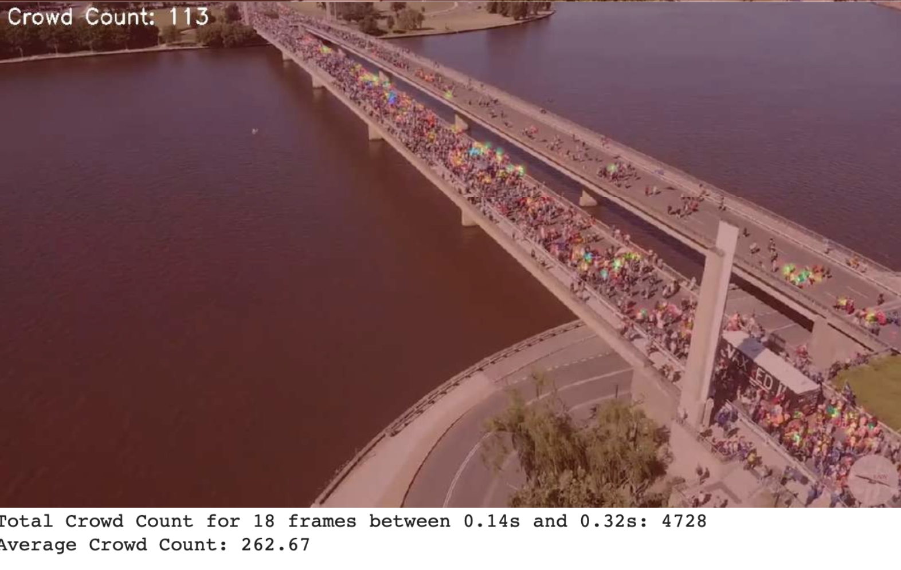

# Crowd Counting Using YOLOv3 and CSRNet


This repository demonstrates the implementation and comparison of two models for crowd counting: **YOLOv3** (a general object detector) and **CSRNet** (a specialized crowd counting model). The project highlights the differences in performance and accuracy between the two models, especially in handling dense crowds.

## Project Overview

The purpose of this project is to estimate the number of people present in an image or video using both **YOLOv3** and **CSRNet**. YOLOv3 struggles with dense, overlapping crowds, while CSRNet, specifically designed for crowd counting, provides more accurate results in such scenarios.

### Why CSRNet Works Better for Crowd Counting

- **YOLOv3**: A general object detector that performs well with clear, separated objects. It uses bounding boxes to detect objects like people, cars, etc. However, it struggles in cases of dense crowds where people are overlapping or occluded.
  
- **CSRNet**: A specialized model for crowd counting. It generates a density map, making it ideal for dense crowd scenarios. The model doesn't rely on detecting each person individually but instead estimates the number of people based on the crowd's overall density.

### Output Comparison
Below are sample outputs from both models applied to the same video:

- **YOLOv3**: Struggles with dense crowds, missing many individuals due to occlusion and overlapping.
- **CSRNet**: Accurately estimates crowd density even in packed areas with significant overlap.

#### YOLOv3 Output


#### CSRNet Output


## Features

- **YOLOv3 Object Detection**: Detects individual objects (people) using bounding boxes.
- **CSRNet Crowd Counting**: Estimates the number of people in the scene by generating a density map.
- **Video Cropping**: Optionally crop a video between specified time ranges for processing.
- **Real-Time Crowd Count Visualization**: Visualize the density map overlay and predicted crowd count for each frame of a video.

## Requirements

- **Python 3.7+**
- **PyTorch 1.7+**
- **OpenCV 4.0+**
- **Matplotlib**
- **SciPy**

To install the dependencies, use the following:

```bash
pip install -r requirements.txt
